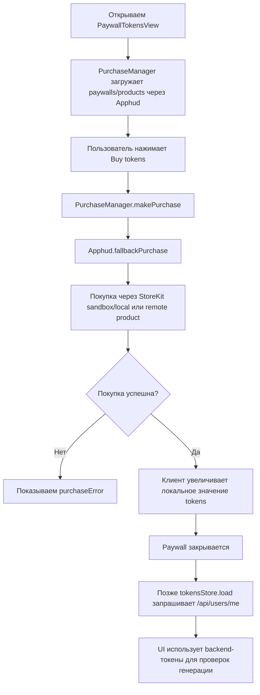

# Схема покупки токенов (текущее состояние)

Этот документ описывает, как сейчас в приложении работает покупка токенов.

## Короткий ответ

- `Demo.storekit` — это **не просто фейковые UI-данные**.
- В этом проекте он используется как **источник каталога продуктов для StoreKit sandbox/local**.
- Реальный поток покупки всё равно идёт через **StoreKit + Apphud**.
- На клиенте нет прямого REST-вызова вида `POST /add_tokens` из `PaywallTokensView`.

Поэтому если баланс токенов на backend меняется после покупки, это, скорее всего, происходит через серверную интеграцию backend/Apphud, а не через прямой API-вызов с этого экрана.

## Текущий поток

## Карта кода

- На старте приложения используется Apphud-ключ из demo-конфига:
  - `Sora/SoraApp.swift`
  - `ApphudConfig.currentKey = demoKey`

- UI paywall токенов и кнопка покупки:
  - `Sora/PaywallTokensView.swift`
  - При успехе: `tokensStore.tokens += added`

- Пайплайн покупки:
  - `Sora/Demo/PurchaseManager.swift`
  - `makePurchase(product:)` -> `Apphud.fallbackPurchase(product:)`

- Фолбэк Apphud (ветка StoreKit в sandbox / при отсутствии SKProduct):
  - `Sora/Demo/Apphud+.swift`
  - Используются StoreKit API покупки и обёртки Apphud

- Чтение токенов с backend:
  - `Sora/Services/TokensStore.swift` -> `AuthService.fetchCurrentUser()`
  - `Sora/Services/AuthService.swift` -> `GET /api/users/me`

## Важное наблюдение

По коду клиента:

- При успешной покупке локальные токены обновляются сразу (для UX).
- В этом потоке нет явного клиентского API-вызова, который напрямую начисляет токены на backend.
- Баланс backend расходуется в generation endpoints и подхватывается позже через `tokensStore.load()`.

Следовательно, если backend тоже обновляется после покупки, связь, вероятно, находится вне этого экрана (например, через серверную обработку App Store receipt/Apphud events и сопоставление по `apphud_id`).

## Почему `Demo.storekit` всё равно может быть «реальным»

- Покупки в StoreKit test/sandbox — это реальные транзакции StoreKit в тестовой среде Apple.
- Это не вручную “замоканные bool-значения”.
- Колбэки Apphud/StoreKit всё равно проходят через реальный purchase flow.

То есть “demo” здесь означает тестовое окружение/источник конфигурации, а не обязательно фейковую механику покупки.

## Твой сценарий: почему сейчас «бесплатно», а backend всё равно начисляет

Что происходит в твоём текущем режиме разработки:

- Приложение работает в `#if DEBUG` и с тестовой конфигурацией Apphud/StoreKit.
- Покупка проходит в sandbox/test-среде Apple (без реального списания денег с карты).
- Транзакция при этом считается валидной тестовой покупкой.
- Backend получает событие через интеграцию Apphud (webhook) и начисляет токены.

Именно поэтому ты не платишь реальные деньги, но токены появляются и могут тратиться в генерациях.

## Что означает ответ backend про `POST /api/subscription/add-tokens`

По ответу backend:

- `POST /api/subscription/add-tokens` с `X-API-Key` — это сервисный endpoint для сервер-сервер сценариев.
- Клиентскому приложению вызывать его **не нужно**.
- Начисление в прод-потоке должно происходить автоматически через Apphud webhook после успешной покупки.

То есть `X-API-Key` не про `user_id`/`apphud_id` из клиента, а про защищённый серверный ключ.

## Как сделать реальные покупки в App Store (прод-сценарий)

Чтобы в релизе покупки были за реальные деньги:

1. Опубликовать IAP-продукты в App Store Connect (токены, подписки) и привязать их к приложению.
2. Проверить, что в Apphud используются продовые paywalls/products и корректные `product_id`.
3. Использовать релизную конфигурацию Apphud-ключа (не тестовую demo-конфигурацию, если она отдельная).
4. Убедиться, что backend webhook от Apphud настроен на production окружение и начисляет токены по событиям покупок.
5. Проверить E2E на TestFlight:
   - покупка проходит,
   - событие доходит до backend,
   - токены появляются в `/api/users/me`,
   - токены тратятся в генерации.

## Важно

- Пока ты тестируешь через sandbox/debug, «денег не списывается» — это ожидаемо.
- В App Store production покупки будут реальными, если App Store Connect + Apphud + webhook backend настроены на прод.

